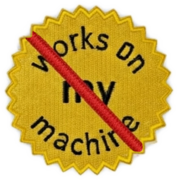
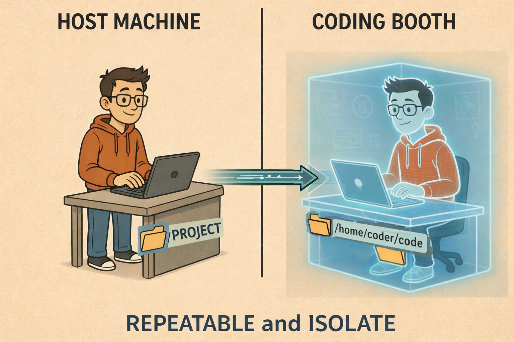
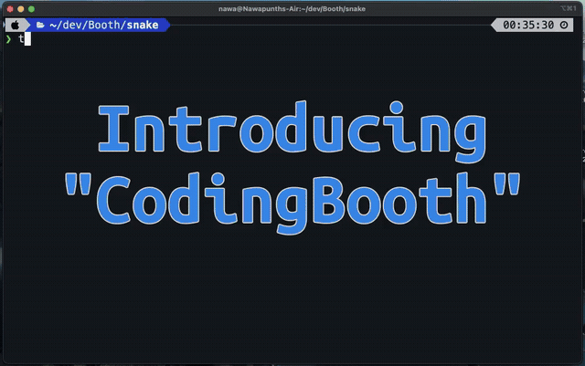
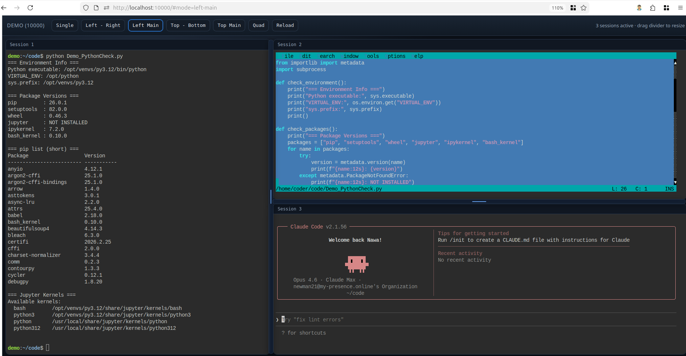
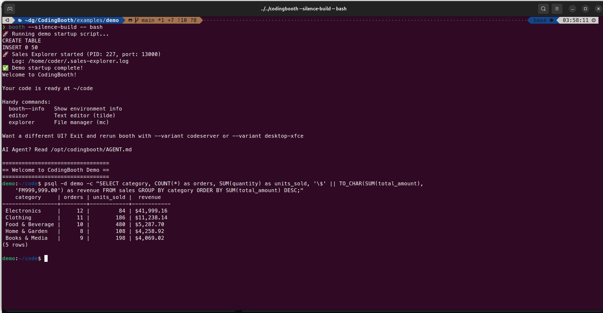
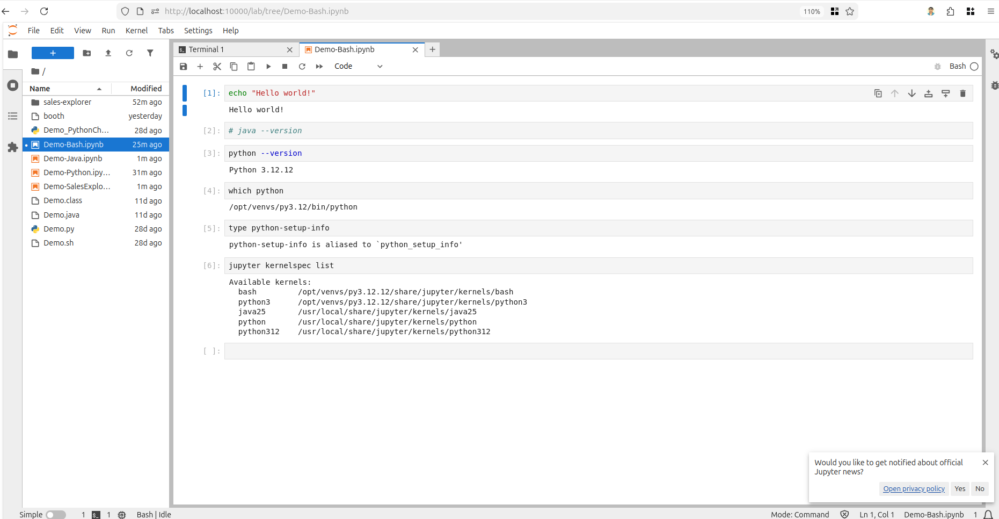
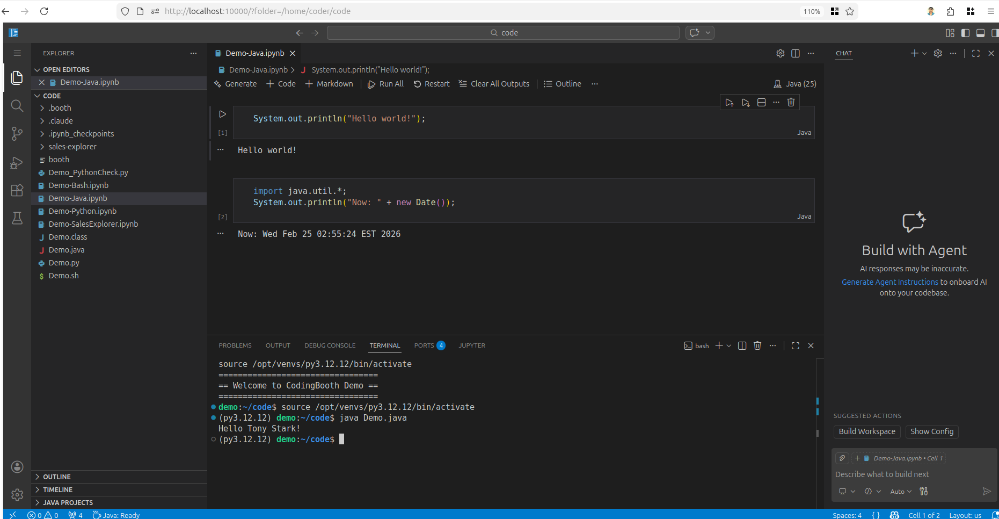
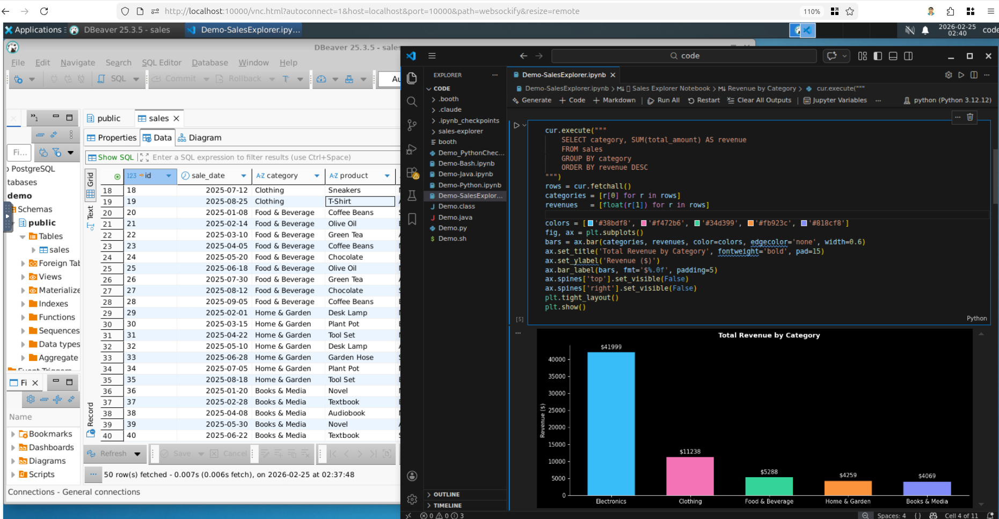
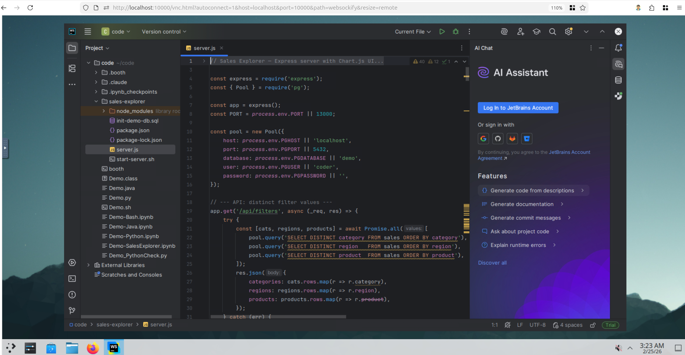

# CodingBooth

**Current Version:** v0.75.0--rc1 — [View Changelog](docs/CHANGELOG.md)



**CodingBooth** delivers fully reproducible, isolated development environments — anywhere, on any machine.

> 🌐 **New here? Start at [codingbooth.io](https://codingbooth.io/)** for a guided tour — demo of the Snake-in-Zig and config TUI walkthroughs, the variant lineup, and a three-step Quick Try. This README is the long-form reference; the site is the friendlier first read.


## Why CodingBooth?

You've containerized your app. You've containerized your build.
But your development environment? Still a mess of system-wide installs, mismatched versions, and onboarding docs no one ever updates?

**CodingBooth fixes that.**

Run a browser-based VS Code workspace, a Jupyter notebook, or even an entire Linux desktop inside a container — with every file owned by you, not root. Your environment lives with the project. **Launch a single command** and it works with your code on every machine.

New teammate joining? Restart the work on a project after months? Run one command and get the exact same environment.
No setup guides. No dependency drift. No "works on my machine."

CodingBooth maps the container's user to **your host UID and GID** — every file you create or modify inside the container is **owned by you on the host**, just as if it were created on your local machine.



Your project files are mounted inside the booth as `/home/coder/code`. Everything else inside the booth is isolated from the host and also ephemeral (will be lost when the booth is closed).


### What This Gives You

- **Seamless file access** – Create, edit, and delete files inside the container, then use them on the host with no permission issues.
- **Team-friendly** – Each developer uses their own UID and GID mapping — no more "root-owned" repositories.
- **Project isolation** – Keep toolchains and dependencies inside the container while working directly in your project folder.
- **Portable configuration** – `.booth/**` travels with your repository, ensuring consistent setups across machines.
- **Pre-configured convenience** - multiple pre-configured setups and variants that are ready to use.


## Who Should Use CodingBooth?

CodingBooth provides reproducible, zero-friction development environments for:

- **Development Teams**: Share identical setups to eliminate "works on my machine" issues and onboard instantly.
- **Multi-Project Developers**: Isolate project dependencies in containers to prevent cross-contamination.
- **Educators and Students**: Distribute uniform environments so everyone can focus on learning, not troubleshooting installations.
- **Researchers and Academics**: Pause and resume work months later with guaranteed environment consistency—no rebuilding necessary.
- **Solo Developers and Hobbyists**: Create portable, self-contained workspaces that run anywhere without bloating your host system with less-used toolchains.

Ready to try it? Browse the demos at [codingbooth.io](https://codingbooth.io/) or jump straight to the [Quick Try](#quick-try) section below.

## Support and Requirements

### Support

- Linux
- MacOS
- Windows

- x86 64bit
- ARM 64bit

### Requirements

- Docker
- Bash
- curl


## Quick Demo

[](https://youtu.be/Rvv3UcOqv3c)

Click the image to watch the demo.

In this demo, I show that the project is a Snake game using Zig, but the host does not have the Zig toolchain installed. Once inside the booth, you can modify and build the game using Zig, run it inside the container, and use the resulting cross-platform binary on the host without having the Zig toolchain installed on the host.

### Variants

CodingBooth supports multiple variants (different UIs that share the same underlying environment).

- **Base** — A minimal terminal session.
- **Notebook** — Jupyter Lab with multi-language kernels (Python, Bash, Java, and more).
- **Code Server** — VS Code running in your browser with full extension support.
- **XFCE Desktop** — A full Linux desktop accessible via your browser.
- **KDE Desktop** — A feature-rich Linux desktop with KDE Plasma.
- **Terminal** — A direct bash session in your host terminal (no browser UI). Shortcut for `booth -- bash`.
- **Command passthrough** — Skip the UI entirely. Run any command inside the container with booth `-- <command>` and get the result directly in your terminal.

For detailed variant information, aliases, and desktop configuration, see the **[Variants Guide](docs/BOOTH_VARIANTS.md)**.

#### Example Screenshots

| Base                                                                          | Terminal                                                                             |
|:-----------------------------------------------------------------------------:|:------------------------------------------------------------------------------------:|
| [](docs/images/Booth-Base.png)             | [](docs/images/Booth-Bash.png)                |
| `booth --variant base`                                                        | `booth --variant terminal`                                                           |

| Notebook                                                                      | Code Server                                                                          |
|:-----------------------------------------------------------------------------:|:------------------------------------------------------------------------------------:|
| [](docs/images/Booth-NoteBook.png) | [](docs/images/Booth-CodeServer.png) |
| `booth --variant notebook`                                                    | `booth --variant codeserver`                                                        |

| XFCE Desktop                                                                  | KDE Desktop                                                                          |
|:-----------------------------------------------------------------------------:|:------------------------------------------------------------------------------------:|
| [](docs/images/Booth-XFCE.png)             | [](docs/images/Booth-KDE.png)                       |
| `booth --variant desktop-xfce`                                                | `booth --variant desktop-kde`                                                        |

A lightweight **LXQt** desktop is also available: `booth --variant desktop-lxqt`.


## Quick Try

### Install CodingBooth

```bash
curl -fsSL https://codingbooth.io/install.sh | bash
```

> **Note:** The `booth` script operates relative to its own location, not the current working directory. You can run `/path/to/project/booth` from anywhere.

For the full install/uninstall reference — shell function, wrapper, binary, `.booth/`, lock file, and shared cache — see **[booth install](docs/BOOTH_INSTALL.md)**.

### Try with an example

CodingBooth provides several ready-to-use examples to get you started.

1. **List available examples**:
   ```bash
   booth example list
   ```

2. **Try an example**:
   ```bash
   booth example try <example-name> <folder>
   ```

3. **Start the booth**:
   ```bash
   cd <folder>
   booth
   ```

At this point, you can inspect the code, modify it, then build and run it.
**NOTE:** Visit http://localhost:10000 in your browser to access the UI (except for command mode).

Not sure which example to start from? See **[Examples](EXAMPLES.md)** — the full catalog, grouped and with a walk-through of three that show the range. For the specific CodingBooth advantage each workspace showcases, see **[What Each Example Demonstrates](docs/EXAMPLES_ADVANTAGES.md)**.

### Try with `booth config ...`

CodingBooth provides `config` and `template` commands to quickly create a new project.

1. **List templates**:
   ```bash
   booth template list
   ```

2. **Create a new project** (interactive TUI):
   ```bash
   booth config
   ```
   Or use CLI mode:
   ```bash
   booth config --no-tui --select java+maven+m2/scala --select claude-code+auto-accept
   ```
   This will set up a booth with:
   - Java
   - Maven
   - bind .m2 folder from host
   - Scala
   - Claude Code
   - Claude Code auto accept

3. **Start the booth**:
   ```bash
   booth
   ```

Explore more with `booth template help` and `booth config help`. See **[booth config documentation](docs/BOOTH_CONFIG.md)** for the full guide.

### Updating

```bash
booth install             # Update to latest version
booth install <version>   # Install a specific version (positional argument)
```


# Table of Contents

- [Why CodingBooth?](#why-codingbooth)
- [Who Should Use CodingBooth?](#who-should-use-codingbooth)
- [Quick Demo](#quick-demo)
- [Quick Try](#quick-try)
- [Common Flags](#common-flags)
- [Command Passthrough](#command-passthrough)
- [Built-in Tools](#built-in-tools)
- [Customization](#customization)
- [How It Works](#how-it-works)
- [Documentation](#documentation)
- [Troubleshooting](#troubleshooting)
- [Developer Setup](#developer-setup)
- [Guidance & Limitations](#guidance--limitations)
- [Community & Feedback](#community--feedback)


## Common Flags

```shell
booth [flags] [-- command...]
```

| Flag                 | Description                                                                      |
|----------------------|----------------------------------------------------------------------------------|
| `--variant <name>`   | Select container variant (base, notebook, codeserver, desktop-xfce, desktop-kde, desktop-lxqt) |
| `--port <port>`      | Host port mapping (number, `NEXT[:base]`, or `RANDOM[:base]`)                    |
| `--name <name>`      | Set container name (supports `{port}` / `{project}` / `{variant}` placeholders)  |
| `--build-arg <arg>`  | Pass build argument to Docker                                                    |
| `-v <host:container>`| Bind mount a file or folder into the container                                   |
| `--`                 | Separator: everything after runs as a command inside the container                |
| `--dind`             | Enable Docker-in-Docker mode                                                     |
| `--keep-alive`       | Preserve container after exit (resume with `booth start <name>`)                 |
| `--persist-home`     | Persist `/home/coder` across sessions using a Docker named volume                |
| `--egress`        | Restrict outbound network to allowlisted domains                                 |
| `--daemon`           | Run container in background                                                      |
| `--no-browser`       | Do not open the booth UI in a browser when it comes up (on by default)           |
| `--silence-build`    | Suppress build/startup output; a build keeps one transient status line           |
| `--quiet`, `-q`      | Hide lifecycle messages (implies `--silence-build` and `--no-browser`)           |
| `--writable-booth`   | Allow writing to `.booth/` inside the container (read-only by default)            |
| `--show-run-time [epoch]` | Display elapsed session time in the lifecycle panel ([details](docs/BOOTH_RUNTIME.md)) |
| `--show-count-down <epoch>` | Display countdown timer to a deadline ([details](docs/BOOTH_RUNTIME.md))         |
| `--count-down-exit-code <code>` | Exit code when countdown expires (default: 0) ([details](docs/BOOTH_RUNTIME.md)) |
| `--log-time`         | Prefix progress messages with timestamps (HH:MM:SS)                              |
| `--leave-tmp-on-exit`| Preserve `.booth/.tmp/` contents on exit for debugging                            |
| `--keep-tmp-on-start`| Preserve `.booth/.tmp/` from previous session on start                            |
| `--dryrun`           | Print docker commands without executing                                          |

Additional Docker pass-through flags (`-e`, `-p`, etc.) can be set via `run-args` in `.booth/config.toml`. For the full flag reference, see **[booth run documentation](docs/BOOTH_RUN.md)**.

### Wrapper vs Binary

The `booth` script is a **wrapper** that manages the underlying `codingbooth` binary:

| Command            | What it shows                               |
|--------------------|---------------------------------------------|
| `booth help`     | Wrapper help (install, update, cache, etc.) |
| `booth --help`   | Binary help (run flags, variants, etc.)     |
| `booth version`  | Wrapper + binary version info               |
| `booth --version`| Binary version only                         |

### Additional Commands

- **Install & uninstall:** `booth install`, `booth update`, `booth uninstall`, `booth tools-cache` — see **[booth install](docs/BOOTH_INSTALL.md)**
- **Templates & scaffolding:** `booth template list`, `booth config` — see **[booth config](docs/BOOTH_CONFIG.md)**
- **Build & publish:** `booth build`, `booth build --push` — see **[booth build](docs/BOOTH_BUILD.md)**
- **Container lifecycle:** `booth start`, `booth stop`, `booth list`, `booth prune` — see **[booth lifecycle](docs/BOOTH_LIFECYCLE.md)**
- **Connect to running booth:** `booth shell`, `booth exec` — see **[booth connect](docs/BOOTH_CONNECT.md)**
- **Messaging:** `booth message send`, `booth message list` — see **[booth message](docs/BOOTH_MESSAGE.md)**
- **Examples:** `booth example list`, `booth example try` — see **[booth example](docs/BOOTH_EXAMPLE.md)**


## Command Passthrough

Use `--` to run commands inside the container and exit:

```shell
booth -- make test
booth -- echo "Hello from container"
booth -- 'python -c "print(1 + 1)"'
```

Everything after `--` is one shell command line run under the container's login shell, so shell
operators work but quoting does not survive — wrap a command that carries its own quotes in a
single quoted argument, as in the third example. Details in
[docs/BOOTH_RUN.md](docs/BOOTH_RUN.md#command-mode----cmd).

Exit codes are forwarded — booth exits with the same code as the command.

Combine with `--silence-build` for clean scripted output:

```shell
> booth --silence-build -- echo "Hello"
Hello
```

To run a command in the **project booth** (reuse it if it is already up, bring it up if not):

```shell
> booth exec --silence-build --run -- ./build.sh
Building viewmd v0.6.0
  -> ./viewmd (9.7M)
Done.
```


## Built-in Tools

Every CodingBooth image comes with a carefully selected set of command-line tools for productivity, scripting, and troubleshooting.
These essentials are preinstalled so you can start working immediately — no extra setup required.

### Included Tool Categories

- **Shells & Process Management**
  `bash`, `zsh`, `tini`

- **Networking & Transfers**
  `curl`, `wget`, `httpie`

- **Source Control & GitHub Integration**
  `git`, `gh` (GitHub CLI), `tig`

- **Editors & File Browsers**
  `nano`, `tilde`, `ranger`, `less`, `viewmd` (Markdown viewer in a browser)

- **Data Processing & Formatting**
  `jq`, `yq`, `tree`

- **Compression & Archiving**
  `unzip`, `zip`, `xz-utils`

- **System Utilities**
  `ca-certificates`, `locales`, `sudo`

---

> Each variant extends this base toolset — for example,
> `notebook` adds Jupyter, and `codeserver` adds a web-based IDE.
> You can also customize your setup by adding additional packages in your Dockerfile.


## Customization

CodingBooth is highly customizable. You can tailor how your environments run by adjusting configuration files or using runtime flags.

- **[Booth Customization Guide](docs/BOOTH_CUSTOMIZATION.md)** — Setup scripts, install scripts, templates, and reusable recipes.
- **[Boothfile Reference](docs/implementations/BOOTHFILE.md)** — The simplified, script-like format for defining container environments.
- **[Home Directory Guide](docs/BOOTH_HOME.md)** — Seeding dotfiles, credentials, and home directory precedence rules.

### The `.booth/` Folder (Quick Overview)

All booth configuration lives in a single `.booth/` folder in your project root:

```
my-project/
└── .booth/
    ├── config.toml     # Launcher configuration
    ├── Boothfile       # Simplified build script (optional, preferred)
    ├── Dockerfile      # Custom Docker build (optional, fallback)
    ├── .env            # Personal env vars (optional, gitignored)
    ├── setups/         # Custom setup scripts (optional)
    ├── home/           # Team-shared home directory files (optional)
    ├── cache/          # Local persistent state (optional, gitignored)
    └── tools/          # Managed by booth wrapper (auto-created)
```

>  **Read-only by default:** The `.booth/` folder is mounted **read-only** inside the container to prevent accidental or malicious modifications to your configuration. Use `--writable-booth` if you need to edit `.booth/` files from inside the container.
>
>  **Local cache:** The `cache/` directory persists files (like shell history) across container sessions. Its structure mirrors the container filesystem and files are automatically bind-mounted. See **[Local Cache Guide](docs/BOOTH_LOCALCACHE.md)**.

---


## How It Works

CodingBooth mirrors your host identity inside the booth — you work as yourself, not as root. This results in a seamless development environment with no permission headaches.

Whoever the user is on your host, the booth will run as the `coder` user.

Only your project folder is mounted inside the booth as `/home/coder/code`.

The files in the `.booth` folder will be mounted inside the booth as `/home/coder/code/.booth` but will be made read-only by default. You can use `--writable-booth` to make them writable.

To learn more about how CodingBooth achieves this, data persistence rules, and in-container documentation, see the **[How It Works Guide](docs/HOW_IT_WORKS.md)**.

For setup script conventions and implementation details, see the **[Booth Setup Guide](docs/BOOTH_SETUP.md)**.

#### For AI Agents

If you're using an AI coding assistant inside a CodingBooth, the agent can find instructions at:

- `/opt/codingbooth/AGENT.md` — the canonical location

This file provides operational instructions specifically for AI agents working inside the container — covering persistence rules, setup patterns, and how to properly configure the environment.

**Optional:** Create a symlink in the home directory so your AI agent discovers it automatically. Add to `.booth/startup.sh`:

```bash
# Link for your AI agent (choose the one you use)
ln -sf /opt/codingbooth/AGENT.md /home/coder/CLAUDE.md      # Anthropic Claude
ln -sf /opt/codingbooth/AGENT.md /home/coder/COPILOT.md     # GitHub Copilot
ln -sf /opt/codingbooth/AGENT.md /home/coder/CURSOR.md      # Cursor IDE
ln -sf /opt/codingbooth/AGENT.md /home/coder/GPT.md         # OpenAI GPT/ChatGPT
ln -sf /opt/codingbooth/AGENT.md /home/coder/GEMINI.md      # Google Gemini
ln -sf /opt/codingbooth/AGENT.md /home/coder/CODEIUM.md     # Codeium/Windsurf
ln -sf /opt/codingbooth/AGENT.md /home/coder/WARP.md        # Warp terminal
```


## Documentation

User-facing guides:

- **[Examples](EXAMPLES.md)** — Install, run your first example, the full catalog, and which setups support version pinning
- **[booth install](docs/BOOTH_INSTALL.md)** — Install and uninstall every layer: shell function, wrapper, binary, `.booth/`, lock file, shared cache
- **[booth run](docs/BOOTH_RUN.md)** — Running containers: image selection, config files, run modes, ports, DinD, TLS
- **[booth config](docs/BOOTH_CONFIG.md)** — Template-driven project scaffolding
- **[booth build](docs/BOOTH_BUILD.md)** — Build and publish booth images to a container registry
- **[booth example](docs/BOOTH_EXAMPLE.md)** — Pre-built example workspaces
- **[booth lifecycle](docs/BOOTH_LIFECYCLE.md)** — Container lifecycle: keep-alive, start, stop, restart, remove, prune
- **[booth connect](docs/BOOTH_CONNECT.md)** — Connect to running booths: open a shell or run commands
- **[booth variants](docs/BOOTH_VARIANTS.md)** — Variant details, aliases, desktop configuration, clipboard, and use cases
- **[booth home](docs/BOOTH_HOME.md)** — Home directory customization: seeding, overrides, credentials
- **[booth persist-home](docs/BOOTH_PERSIST_HOME.md)** — Persist entire home directory across sessions via Docker volume
- **[booth cache](docs/BOOTH_LOCALCACHE.md)** — Local persistent state: shell history, tool configs across sessions
- **[booth expose](docs/BOOTH_EXPOSE.md)** — Runtime port tunneling: expose container ports to the host without restarting
- **[booth message](docs/BOOTH_MESSAGE.md)** — Send interactive messages and toast notifications to booth users
- **[booth runtime](docs/BOOTH_RUNTIME.md)** — Session timers: elapsed time and countdown to shutdown
- **[booth tmp](docs/BOOTH_TMP.md)** — Ephemeral runtime state: `.booth/.tmp/` lifecycle and debugging

For deeper technical details on how CodingBooth works internally, see [docs/implementations/](docs/implementations/):

- **[Booth Init](docs/implementations/BOOTHINIT.md)** — Template-driven project scaffolding (`booth config` and `booth template`)
- **[Booth Lifecycle](docs/implementations/BOOTH_LIFECYCLE.md)** — Container lifecycle management implementation
- **[Examples](docs/implementations/EXAMPLES.md)** — Examples system and release workflow
- **[What Each Example Demonstrates](docs/EXAMPLES_ADVANTAGES.md)** — Every example workspace and the advantage it showcases
- **[Deploying the Site](docs/DEPLOY_SITE.md)** — How codingbooth.io is published (auto-deploy to DreamHost, short example links)
- **[Wrapper](docs/implementations/WRAPPER.md)** — The booth wrapper script that manages binary downloads and verification
- **[User Permissions](docs/implementations/USER_PERMISSIONS.md)** — UID/GID mapping between host and container
- **[Desktop + noVNC](docs/implementations/DESKTOP_NOVNC.md)** — VNC server and browser-based desktop access
- **[Variant Selection](docs/implementations/VARIANTS.md)** — How variants and aliases are resolved
- **[Docker-in-Docker](docs/implementations/DIND.md)** — Running Docker inside CodingBooth
- **[Egress](docs/implementations/EGRESS.md)** — Egress filtering with Envoy proxy and iptables
- **[Booth-in-Booth](docs/implementations/BOOTH_IN_BOOTH.md)** — Nested booth detection and opt-in mechanism


## Troubleshooting

### "Docker not found" or "Cannot connect to Docker daemon"

```bash
# Check if Docker is installed and running
docker version

# If permission denied, add yourself to docker group
sudo usermod -aG docker $USER
# Then logout and login again
```

### "Permission denied" on project files

This usually means the container's user doesn't match your host user. CodingBooth handles this automatically, but if you see issues:

```bash
# Check your UID/GID
id

# Verify booth is passing them correctly
booth --dryrun --verbose | grep HOST_UID
```

### "Port already in use"

```bash
# Find what's using the port
lsof -i :10000

# Use a different port
booth --port 10001

# Or let CodingBooth find the next available port
booth --port NEXT

# ...starting the search from a chosen base
booth --port NEXT:20000
```

> **Running several booths of the same project?** Just run `booth` again — the port
> auto-advances (`--port` defaults to `NEXT`) and the container name auto-suffixes
> with the port on collision (`myproj` → `myproj-12000`). For an explicit unique
> name use a placeholder: `booth --name '{project}-{port}'`.
> See [booth run](docs/BOOTH_RUN.md#ports).

### "Container exits immediately"

Common causes:
- **Command failed** — Check the exit code and logs
- **Missing dependencies** — Ensure your Dockerfile installs everything needed
- **Syntax error in startup script** — Check `.booth/startup.sh`

```bash
# Debug by getting a shell instead
booth --variant base

# Check container logs
docker logs <container-name>
```

### "Build takes forever" / "Downloading same packages every time"

Your Dockerfile might not be using layer caching effectively:
- Put rarely-changing commands first
- Use `COPY requirements.txt` before `RUN pip install`
- Don't run `apt-get update` and `apt-get install` in separate layers

### Desktop variant shows black screen

- Wait a few seconds — VNC server takes time to start
- Check `~/.vnc/*.log` inside the container for errors
- Verify dbus is running: `pgrep dbus-daemon`

### "Network timeout" when installing packages

If behind a corporate proxy:
```toml
# .booth/config.toml
run-args = [
    "-e", "HTTP_PROXY=http://proxy.company.com:8080",
    "-e", "HTTPS_PROXY=http://proxy.company.com:8080"
]
```

### Still stuck?

1. Try `--verbose` for detailed debug output
2. Use `--dryrun` to see the exact Docker command
3. Check [GitHub Issues](https://github.com/NawaMan/CodingBooth/issues) for similar problems
4. Open a new issue with your config and error message


## Developer Setup

If you're contributing to CodingBooth, run the onboarding script to set up git hooks:

```bash
./on-board-me.sh
```

This activates a **pre-commit hook** that prevents committing when `version.txt` and `README.md` have mismatched versions.
The hook only triggers when either file is staged — it won't interfere with unrelated commits.

---


## Guidance & Limitations

- **Host file ownership:** All files in your project folder remain owned by your host user — no "root-owned" files.
- **Consistent user mapping:** Each container automatically creates a matching user and group via `booth-entry`.
- **Cross-OS caveats:** CodingBooth doesn't abstract away all host OS differences — things like line endings, symlinks, or file attributes may still vary between platforms.

### Security Considerations

CodingBooth is designed for development environments, not production workloads. Key security aspects:

| Aspect               | Behavior                                                                  |
|----------------------|---------------------------------------------------------------------------|
| **User privileges**  | Processes run as unprivileged `coder` user, not root                      |
| **Sudo access**      | `coder` has passwordless sudo (for installing packages)                   |
| **File ownership**   | Files match your host UID/GID — no root-owned files                       |
| **`.booth/` config** | Read-only inside the container by default (`--writable-booth` to opt out) |
| **Network**          | Full network access by default                                            |
| **Egress**   | Optional `--egress` mode restricts outbound connections to allowlisted domains via Envoy proxy + iptables ([details](docs/implementations/EGRESS.md)) |
| **DinD mode**        | Requires `--privileged` flag (elevated permissions)                       |

**Best practices:**
- Don't run untrusted code in CodingBooth containers
- Avoid mounting sensitive host directories beyond what's needed
- Use `--egress` to restrict egress when running third-party or untrusted dependencies
- DinD mode grants significant privileges — use only when needed

> **Note:** CodingBooth prioritizes developer experience over strict isolation. For production containers or multi-tenant environments, use standard Docker security practices.

### JetBrains IDE Licensing in Containers

JetBrains activation is stored as a machine-specific token. When you run an IDE backend inside a container, a fresh container may be treated as a new machine, so you may be asked to sign in again unless IDE state is persisted.

**Recommended approaches:**
- **JetBrains Gateway (preferred):** license checked on your local machine; container backend doesn't store license data.
- **Persistent volumes:** mount configs/caches/plugins if you run a full GUI IDE inside the container.
- **License Vault:** for short-lived containers / multi-machine scenarios.

---


<!-- SYNC: keep this section in sync with the "Community & Feedback" section in /site/index.html (#community) -->
## Community & Feedback

CodingBooth is built to meet **real developer needs** — simple, reproducible, and flexible without unnecessary complexity.
Your feedback and contributions help it evolve and stay relevant for everyone.

### Issues & Contributions

- **Report Bugs & Request Features:** Use the **[Issues page](https://github.com/NawaMan/CodingBooth/issues)** to report bugs, request features, or suggest improvements.
- **Pull Requests:** PRs are always welcome — but I reserve the right to reject any PR that doesn't align with my vision for the project.
- **Discussions:** Have a creative idea, workflow, or enhancement to share? Open an issue or discussion — I'd love to hear it.
- **Direct Contact:** Prefer to reach out directly? Feel free to contact me through any of the links below.

### Support & Appreciation

If CodingBooth has saved you time, simplified your setup, or made development more enjoyable, please consider supporting the project:

- **[Sponsor me on GitHub](https://github.com/sponsors/NawaMan)**
- **[Buy me a coffee](https://buymeacoffee.com/NawaMan)**

Your encouragement keeps this project active — and might even help with my kids' college fund.

### Connect

Stay in touch or follow updates, insights, and development notes:

- **Twitter/X:** [@nawaman](https://x.com/nawaman)
- **LinkedIn:** [nawaman](https://www.linkedin.com/in/nawaman/)
- **Blog:** [nawaman.net/blog](https://nawaman.net/blog/)

---

> Every issue, idea, and pull request — big or small — helps make CodingBooth better for everyone.
> Thank you for being part of the community!
<!-- /SYNC -->

