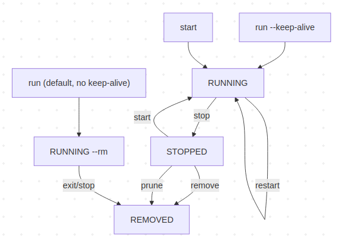
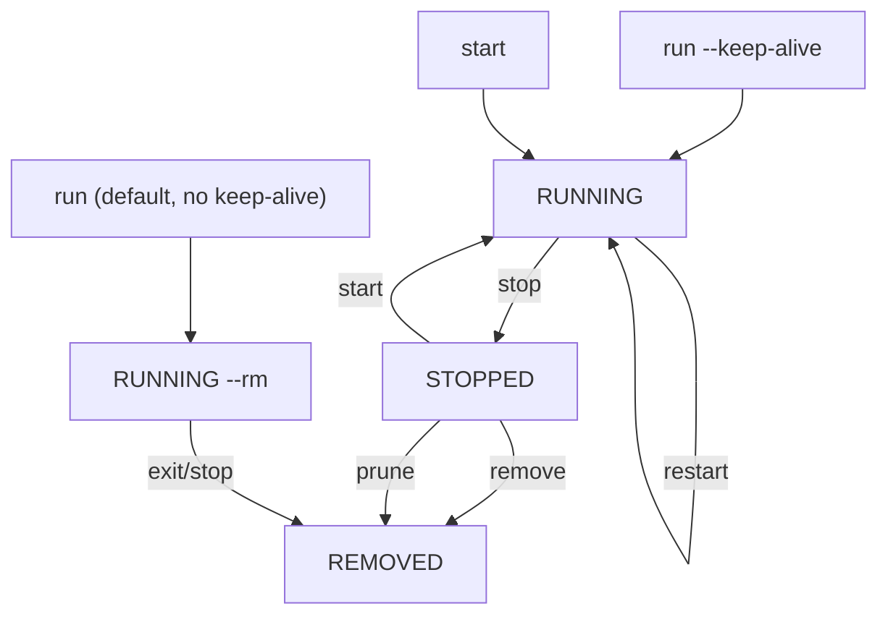

# Booth Lifecycle

A reproducible booth is useful; a resumable booth is a workflow multiplier.

## Purpose
This document defines the technical behavior of CodingBooth lifecycle management for Phase 1.

Lifecycle commands are designed around container reuse. Reuse is enabled when the booth is created with `--keep-alive`.

## Scope
Implemented commands:
- `run` (with lifecycle labels)
- `list`
- `start`
- `stop`
- `restart`
- `remove`
- `prune`

Out of scope in this phase:
- `commit`, `push`, `backup`, `restore`
- Cross-user UID/GID ownership migration automation

## Lifecycle Model
Container state model:
- `run` -> creates booth container
- `start` -> resumes stopped keep-alive container
- `stop` -> stops running booth; removes it only when not keep-alive
- `restart` -> restarts running booth
- `remove` -> removes specified booth container(s)
- `prune` -> removes all stopped booth-managed containers (with confirmation)

Important rule:
- Without `--keep-alive`, the default run path uses `--rm`; after exit there is no resumable container state.

### Flow Chart

Source definition: see [Appendix A: Mermaid Source](#appendix-a-mermaid-source).

### Command-to-Transition Table
| Command             | From                                | To                | Notes                              |
|---------------------|-------------------------------------|-------------------|------------------------------------|
| `run --keep-alive`  | none                                | running           | Resumable container created        |
| `run` (default)     | none                                | removed on exit   | Uses `--rm`; no resumable state    |
| `start`             | stopped                             | running           | Reuses existing container config   |
| `stop`              | running                             | stopped or removed | Removed when `cb.keep-alive=false` |
| `restart`           | running                             | running           | Same container identity            |
| `remove`            | stopped (or running with `--force`) | removed           | Explicit cleanup                   |
| `prune`             | stopped set                         | removed           | Batch cleanup with prompt          |

## Container Metadata Contract
Booth-managed containers are identified and queried by labels:
- `cb.managed=true`
- `cb.project=<project-name>`
- `cb.variant=<resolved-variant>`
- `cb.code-path=<absolute-code-path>`
- `cb.created-at=<RFC3339 UTC timestamp>`
- `cb.version=<codingbooth-version>`
- `cb.keep-alive=<true|false>`

These labels support robust filtering and state lookup for lifecycle commands.

## Command Semantics
### `list`
- Filters on `cb.managed=true`
- Supports:
  - `--running`
  - `--stopped`
  - `--quiet` / `-q`
- Output includes state, variant, keep-alive, host port, code path, and created timestamp.

### `start`
- Target resolution priority:
  1. `--name`
  2. positional name
  3. `--code <path>`
  4. default booth name from current directory
- Starts only stopped targets.
- `--daemon` / `-d` starts detached.

### `stop`
- Stops only running targets.
- `--force` / `-f` uses kill path.
- `--time <sec>` controls graceful timeout.
- If `cb.keep-alive=false`, container is removed after stop.

### `restart`
- Operates on running targets.
- `--time <sec>` is passed through to Docker restart timeout.

### `remove`
- Removes target container(s) by `--name` or positional names.
- Refuses running containers unless `--force` is provided.

### `prune`
- Finds all stopped booth-managed containers.
- Prompts by default before deletion.
- `--yes` / `-y` skips prompt.

## Persistence Rules
For an existing container resumed via `start`/`restart`:
- Container identity is unchanged.
- Existing runtime configuration persists and is not mutable through start/restart:
  - `--name`
  - UI `--port`
  - additional `-v` bind mounts
  - additional `-p` port mappings

To change those values, the container must be removed and recreated (`run`).

## Error Handling and UX
- Name collisions during `run` fail with actionable remediation.
- Lifecycle commands return explicit state-aware errors:
  - not found
  - wrong state (running vs stopped)
  - invalid flag combinations
- Command-level wrappers map internal command errors to CLI exit codes.

## Code Map
Core implementation and command wiring:
- CLI command routing: [`cli/src/cmd/codingbooth/main.go`](../../cli/src/cmd/codingbooth/main.go)
- Lifecycle command wrappers: [`cli/src/cmd/codingbooth/lifecycle_cmd.go`](../../cli/src/cmd/codingbooth/lifecycle_cmd.go)
- Lifecycle engine: [`cli/src/pkg/lifecycle/lifecycle.go`](../../cli/src/pkg/lifecycle/lifecycle.go)
- Run label injection: [`cli/src/pkg/booth/booth.go`](../../cli/src/pkg/booth/booth.go)
- Name-collision guard: [`cli/src/pkg/booth/booth_runner.go`](../../cli/src/pkg/booth/booth_runner.go)

Test references:
- Lifecycle unit tests: [`cli/src/pkg/lifecycle/lifecycle_test.go`](../../cli/src/pkg/lifecycle/lifecycle_test.go)
- Label tests: [`cli/src/pkg/booth/lifecycle_labels_test.go`](../../cli/src/pkg/booth/lifecycle_labels_test.go)

## Testing
### Automated (complex)
- `tests/complex/test-lifecycle/test--lifecycle.sh`
  - full run/start/restart/stop/remove round-trip
- `tests/complex/test-lifecycle-name-port/test--lifecycle-name-port.sh`
  - name/port persistence + non-overridability behavior
- `tests/complex/test-lifecycle-bind-port/test--lifecycle-bind-port.sh`
  - bind and extra port persistence across stop/start

### Manual
- `tests/manual/run-lifecycle-cross-user-manual-test.sh`
  - cross-user restore scenario and environment-limitation reporting
  - supports `--user <username>` and `--yes`

## Known Limitations
Cross-user image restore remains a known limitation:
- An image created by one host UID/GID and run by another may encounter ownership/permission issues in `/home/coder`.
- Automatic ownership migration is deferred.

## Operational Recommendation
For long-running or concurrently active booths, prefer explicit, predictable host ports.
Examples:
- high fixed ports (for example `50000`)
- offset local ports (for example `10001`)

`NEXT` and `RANDOM` currently allocate in increments of 1000 starting at `10000`.

## Appendix A: Mermaid Source

